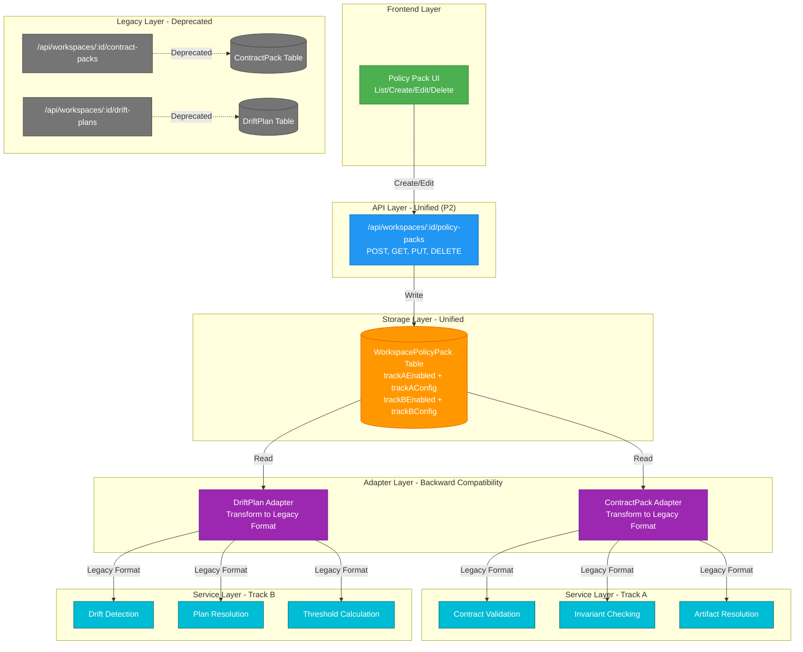
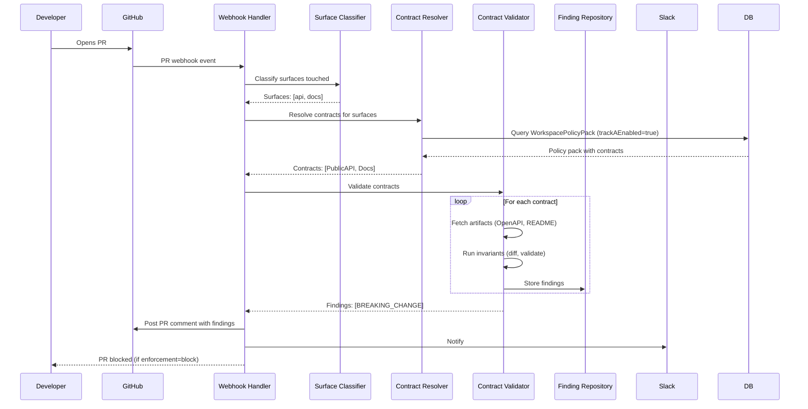
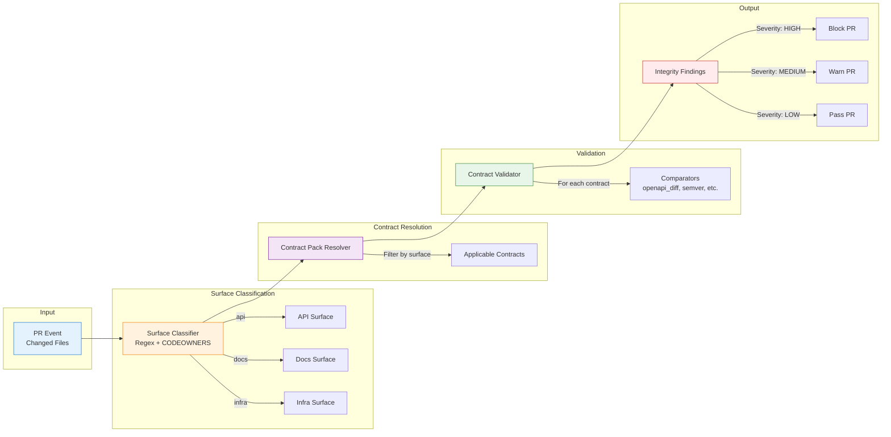
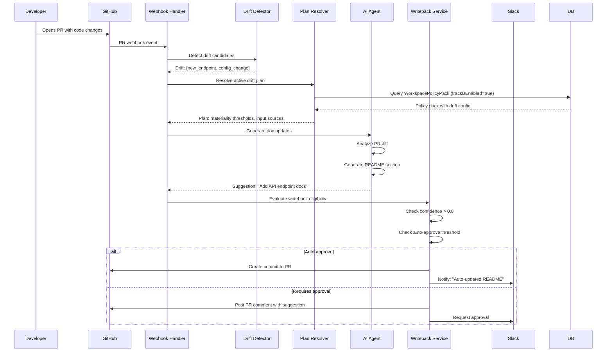
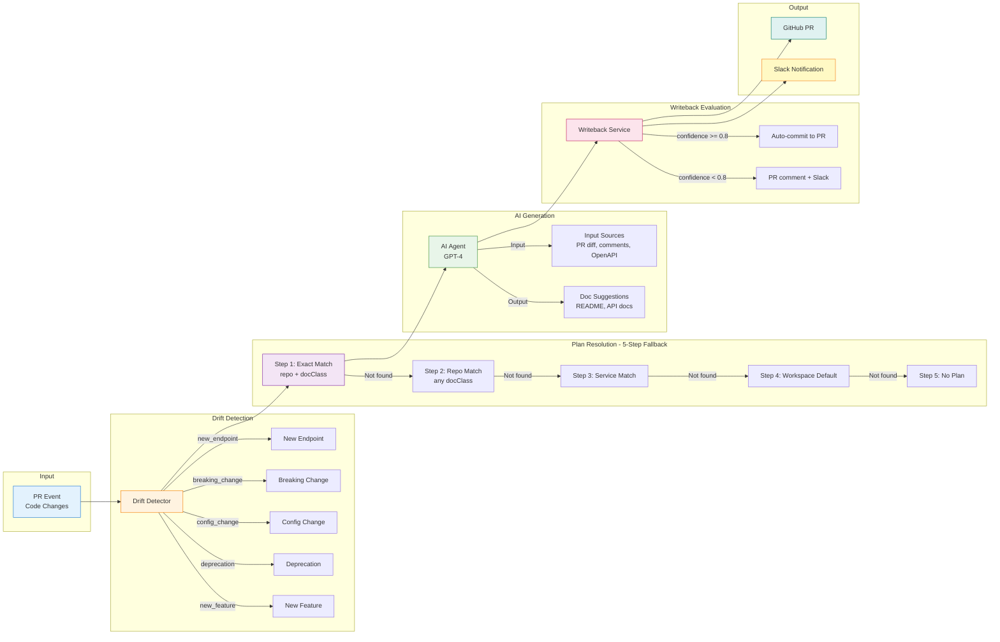
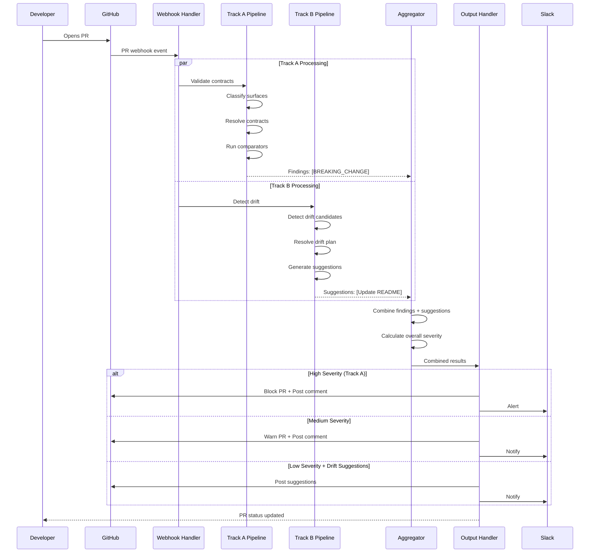
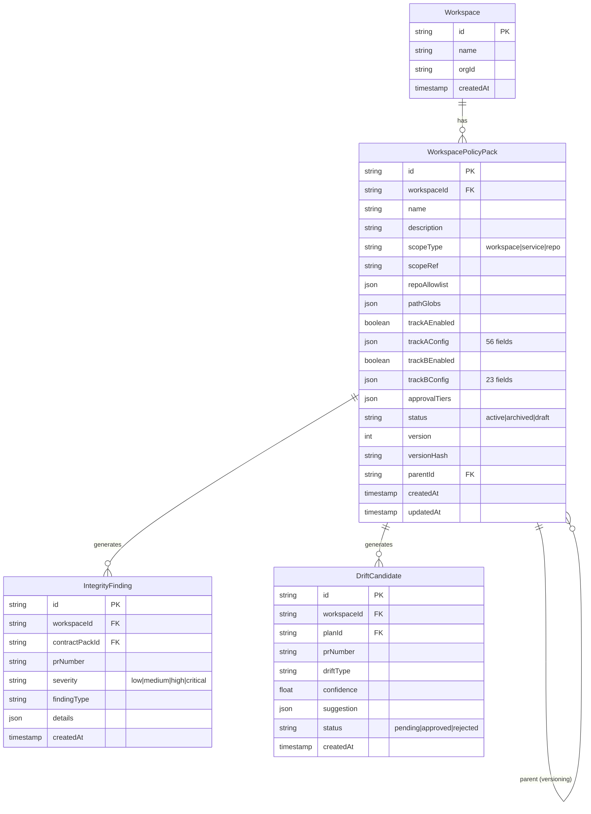
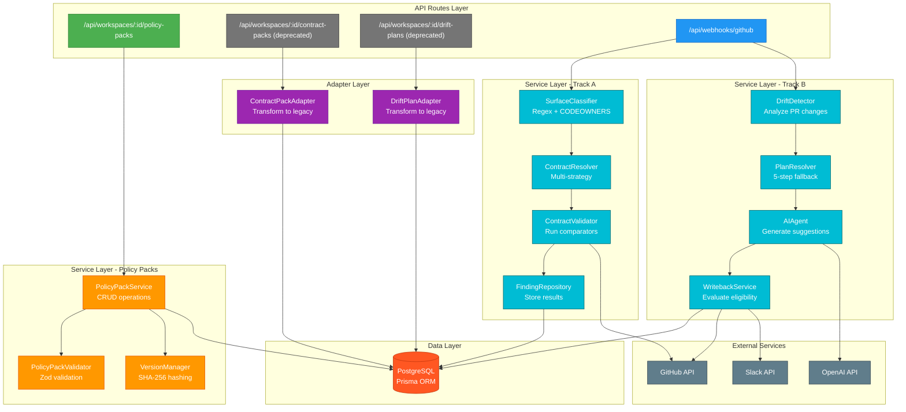

# VertaAI Architecture Diagrams

**Date:** 2026-02-16  
**Version:** 1.0  
**Status:** ✅ Complete

---

## Table of Contents

1. [P2 Unified Policy Pack Architecture](#1-p2-unified-policy-pack-architecture)
2. [Track A: Contract Integrity Gate Flow](#2-track-a-contract-integrity-gate-flow)
3. [Track B: Drift Remediation Flow](#3-track-b-drift-remediation-flow)
4. [End-to-End PR Processing Flow](#4-end-to-end-pr-processing-flow)
5. [Data Model Architecture](#5-data-model-architecture)
6. [Service Layer Architecture](#6-service-layer-architecture)

---

## 1. P2 Unified Policy Pack Architecture

### 1.1 System Overview



### 1.2 Migration Status

| Component | Status | Description |
|-----------|--------|-------------|
| ✅ Unified Storage | Complete | `WorkspacePolicyPack` table stores both Track A and Track B |
| ✅ Unified API | Complete | `/api/workspaces/:id/policy-packs` CRUD endpoints |
| ✅ Unified UI | Complete | `/policy-packs` page with multi-step wizard |
| ✅ Adapter Layer | Complete | Transforms unified model to legacy formats |
| ⏳ Legacy Deprecation | In Progress | Legacy routes functional but deprecated |
| 🔜 Legacy Removal | Planned | Remove `ContractPack` and `DriftPlan` tables |

---

## 2. Track A: Contract Integrity Gate Flow

### 2.1 Functional Flow



### 2.2 Technical Architecture



---

## 3. Track B: Drift Remediation Flow

### 3.1 Functional Flow



### 3.2 Technical Architecture



---

## 4. End-to-End PR Processing Flow

### 4.1 Combined Track A + Track B Processing



### 4.2 Decision Matrix

| Track A Severity | Track B Confidence | Action | Output |
|------------------|-------------------|--------|--------|
| HIGH (blocking) | Any | Block PR | PR comment + Slack alert |
| MEDIUM (warn) | >= 0.8 | Warn + Auto-update | PR comment + Auto-commit |
| MEDIUM (warn) | < 0.8 | Warn + Suggest | PR comment + Slack notify |
| LOW | >= 0.8 | Pass + Auto-update | Auto-commit + Slack notify |
| LOW | < 0.8 | Pass + Suggest | PR comment |
| NONE | >= 0.8 | Auto-update only | Auto-commit |
| NONE | < 0.8 | Suggest only | PR comment |

---

## 5. Data Model Architecture

### 5.1 Entity Relationship Diagram



### 5.2 Track A Config Schema (56 Fields)

```typescript
interface TrackAConfig {
  // Contract Pack Model (7 fields)
  surfaces: string[];                    // ['api', 'docs', 'infra']
  enforcementMode: 'off' | 'warn' | 'block';
  scopeType: 'workspace' | 'service' | 'repo';
  scopeRef?: string;
  repoAllowlist?: string[];
  pathGlobs?: string[];

  // Contracts (18 fields per contract)
  contracts: Array<{
    contractId: string;
    name: string;
    description?: string;
    scope: {
      repos: string[];
      paths: string[];
    };

    // Artifacts (11 fields per artifact)
    artifacts: Array<{
      system: 'github' | 'confluence' | 'notion';
      type: 'openapi_spec' | 'readme' | 'schema';
      locator: {
        repo?: string;
        path?: string;
        ref?: string;
      };
      role: 'primary' | 'reference';
      required: boolean;
      freshnessSlaHours?: number;
    }>;

    // Invariants (7 fields per invariant)
    invariants: Array<{
      invariantId: string;
      comparatorType: string;
      description?: string;
      config: any;
      severity: 'low' | 'medium' | 'high' | 'critical';
      enforcement: 'off' | 'warn' | 'block';
    }>;
  }>;

  // Contract Policy (9 fields)
  policy: {
    mode: 'off' | 'warn' | 'block';
    criticalThreshold: number;
    highThreshold: number;
    mediumThreshold: number;
    lowThreshold: number;
    active: boolean;
  };
}
```

### 5.3 Track B Config Schema (23 Fields)

```typescript
interface TrackBConfig {
  // Primary Doc (3 fields)
  primaryDoc: {
    id: string;
    system: 'github' | 'confluence' | 'notion';
    class: 'readme' | 'runbook' | 'api_contract';
  };

  // Input Sources (5 types)
  inputSources: Array<{
    type: 'github_pr' | 'code_comments' | 'openapi_spec' | 'slack' | 'jira';
    enabled: boolean;
    weight: number;
  }>;

  // Drift Types (5 types)
  driftTypes: Array<{
    type: 'new_endpoint' | 'breaking_change' | 'config_change' | 'deprecation' | 'new_feature';
    enabled: boolean;
    defaultSeverity: 'low' | 'medium' | 'high';
  }>;

  // Materiality Thresholds (4 sliders)
  materiality: {
    autoApprove: number;      // 0.0 - 1.0
    slackNotify: number;      // 0.0 - 1.0
    digestOnly: number;       // 0.0 - 1.0
    ignore: number;           // 0.0 - 1.0
  };

  // Doc Targeting (3 fields)
  docTargeting: {
    mode: 'explicit' | 'auto_discover';
    primaryDocId?: string;
    fallbackStrategy: 'workspace_default' | 'service_default';
  };

  // Noise Controls (7 fields)
  noiseControls: {
    minConfidence: number;
    maxSuggestionsPerPr: number;
    deduplicationWindow: number;
    ignorePatterns: string[];
  };

  // Budgets (3 fields)
  budgets: {
    maxTokensPerSuggestion: number;
    maxSuggestionsPerDay: number;
  };

  // Writeback (3 fields)
  writeback: {
    enabled: boolean;
    autoApproveThreshold: number;
    requiresApproval: boolean;
  };
}
```

---

## 6. Service Layer Architecture

### 6.1 Component Diagram



### 6.2 Key Service Responsibilities

| Service | Responsibility | Input | Output |
|---------|---------------|-------|--------|
| **PolicyPackService** | CRUD for unified policy packs | API requests | WorkspacePolicyPack records |
| **ContractPackAdapter** | Transform unified → legacy Track A | WorkspacePolicyPack | ContractPack format |
| **DriftPlanAdapter** | Transform unified → legacy Track B | WorkspacePolicyPack | DriftPlan format |
| **SurfaceClassifier** | Identify surfaces touched by PR | PR file list | Surface tags |
| **ContractResolver** | Find applicable contracts | Surfaces + workspace | Contract list |
| **ContractValidator** | Run comparators on contracts | Contracts + artifacts | Integrity findings |
| **DriftDetector** | Detect drift candidates | PR diff | Drift candidates |
| **PlanResolver** | Find applicable drift plan | Workspace + repo + docClass | DriftPlan |
| **AIAgent** | Generate doc suggestions | Drift candidates + plan | Doc suggestions |
| **WritebackService** | Evaluate and execute writeback | Suggestions + thresholds | GitHub commit or PR comment |

---

## 7. Summary

### 7.1 Architecture Highlights

✅ **Unified Storage**: Single `WorkspacePolicyPack` table for both Track A and Track B
✅ **Backward Compatibility**: Adapter layer transforms unified model to legacy formats
✅ **Parallel Processing**: Track A and Track B run independently and aggregate results
✅ **5-Step Fallback**: Drift plan resolution with workspace → service → repo hierarchy
✅ **Confidence-Based Writeback**: Auto-commit high-confidence suggestions, manual review for low-confidence
✅ **Multi-Surface Support**: API, docs, infra surfaces with different contract requirements

### 7.2 Key Design Decisions

| Decision | Rationale |
|----------|-----------|
| Unified `WorkspacePolicyPack` model | Reduces duplication, shared approval tiers, consistent UX |
| Adapter layer for backward compatibility | Allows gradual migration without breaking existing services |
| JSON blobs for Track A/B configs | Flexibility for 56 + 23 configurable fields without schema changes |
| SHA-256 version hashing | Deterministic versioning based on content |
| Soft delete with `status` field | Audit trail and ability to restore archived packs |
| 5-step plan resolution fallback | Graceful degradation from specific to general |

---

**End of Architecture Diagrams Document**


