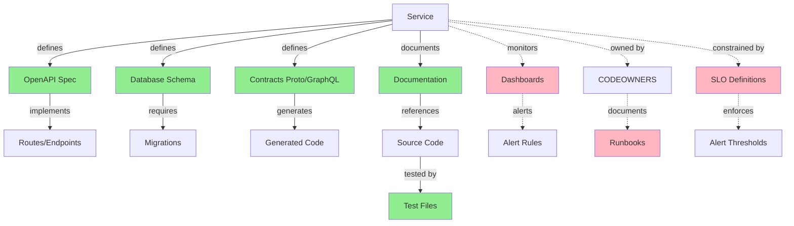
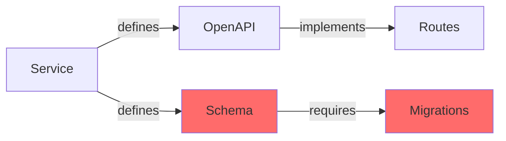

# Artifact Graph Architecture (11.1 Acceptance Criteria)

## 🎯 **Goal**

Transform implicit cross-artifact checks into an **explicit artifact graph** that:
1. Models relationships between artifacts as a directed graph
2. Enforces parity invariants across edges
3. Visualizes drift in PR output
4. Enables longitudinal drift tracking (foundation for 11.2)

---

## 📐 **Data Model**

### **ArtifactNode**
```typescript
interface ArtifactNode {
  id: string;              // e.g., "openapi", "schema", "migrations"
  type: ArtifactType;      // "spec" | "implementation" | "documentation" | "test" | "config"
  paths: string[];         // File paths that constitute this artifact
  lastModified?: Date;     // When this artifact was last changed
  metadata?: Record<string, any>;
}

type ArtifactType = 
  | 'spec'           // OpenAPI, Protobuf, GraphQL schema
  | 'implementation' // Code files
  | 'documentation'  // Markdown, runbooks
  | 'test'           // Test files
  | 'config'         // Dashboards, alerts, SLOs
  | 'data'           // Database schema, migrations
  | 'ownership';     // CODEOWNERS, PagerDuty
```

### **ArtifactEdge**
```typescript
interface ArtifactEdge {
  id: string;              // e.g., "openapi-to-routes"
  from: string;            // Source artifact ID
  to: string;              // Target artifact ID
  relationship: EdgeRelationship;
  invariant: string;       // Human-readable invariant description
  comparatorId: ComparatorId;  // Which comparator enforces this edge
  bidirectional: boolean;  // If true, both directions must stay in sync
}

type EdgeRelationship =
  | 'defines'        // OpenAPI defines routes
  | 'implements'     // Routes implement OpenAPI
  | 'documents'      // Docs document code
  | 'tests'          // Tests test implementation
  | 'monitors'       // Dashboards monitor service
  | 'owns'           // CODEOWNERS owns service
  | 'constrains';    // SLO constrains service behavior
```

### **ArtifactGraph**
```typescript
interface ArtifactGraph {
  nodes: Map<string, ArtifactNode>;
  edges: Map<string, ArtifactEdge>;
  
  // Drift detection results
  driftEdges: {
    edgeId: string;
    severity: number;      // 0-100
    evidence: EvidenceItem[];
    detectedAt: Date;
  }[];
}
```

---

## 🏗️ **Implementation Plan**

### **Phase 1: Add Graph to Governance IR** ✅
1. Add `ArtifactGraph` to `NormalizedEvaluationResult`
2. Build graph from auto-invoked comparator results
3. Store graph in evaluation result

### **Phase 2: Extend Comparators to Return Graph Data** ✅
1. Each comparator returns artifact nodes + edges it checked
2. Pack evaluator aggregates into single graph
3. Graph shows which edges have drift

### **Phase 3: Render Graph in PR Output** ✅
1. Generate Mermaid diagram showing artifact graph
2. Highlight drift edges in red
3. Show in collapsed section of PR output

### **Phase 4: Add 3 Missing Edges** 🔄
1. **DASHBOARD_SERVICE_PARITY** - service → dashboards → alerts
2. **RUNBOOK_OWNERSHIP_PARITY** - service → runbook → ownership
3. **SLO_THRESHOLD_PARITY** - service → SLO → alert thresholds

### **Phase 5: Enable Drift History Tracking** 🔄
1. Store graph snapshots in database
2. Track drift events over time
3. Calculate metrics (recurring violations, time-to-fix)

---

## 📊 **Complete Artifact Graph**



**Legend:**
- Solid lines = Implemented edges
- Dashed lines = Missing edges (to be implemented)
- Green = Working comparators
- Pink = New comparators needed

---

## 🎨 **PR Output Example**

```markdown
## 🔍 Cross-Artifact Integrity Graph

<details>
<summary>View artifact graph (1 drift detected)</summary>



**Drift Detected:**
- 🔴 **Schema → Migrations** - Schema changed but no migration added

</details>
```

---

## 📈 **Benefits**

1. **Explicit > Implicit** - Graph is a first-class data structure, not hidden in comparator logic
2. **Visualizable** - Developers can see the artifact relationships
3. **Trackable** - Foundation for drift history (11.2)
4. **Extensible** - Easy to add new edges (dashboards, runbooks, SLOs)
5. **Differentiator** - "Governance layer, not bot" - no other tool does this

---

## 🚀 **Next Steps**

1. Implement `ArtifactGraph` in Governance IR
2. Update comparators to return graph data
3. Build graph aggregation in pack evaluator
4. Render Mermaid diagram in PR output
5. Add 3 missing comparators (dashboards, runbooks, SLOs)

